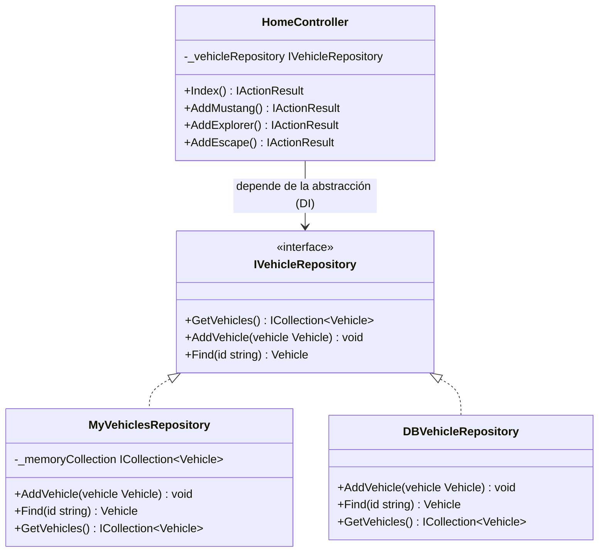
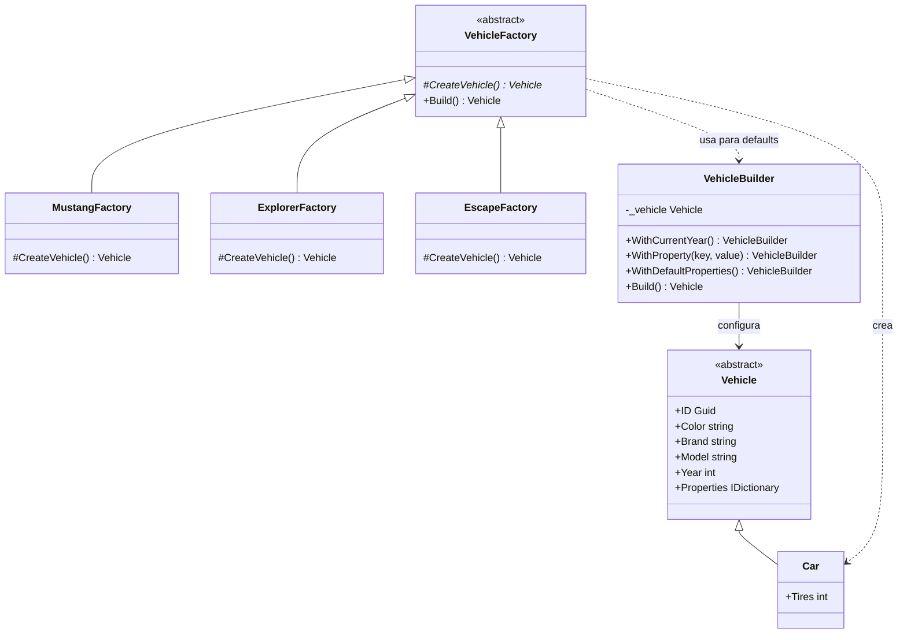
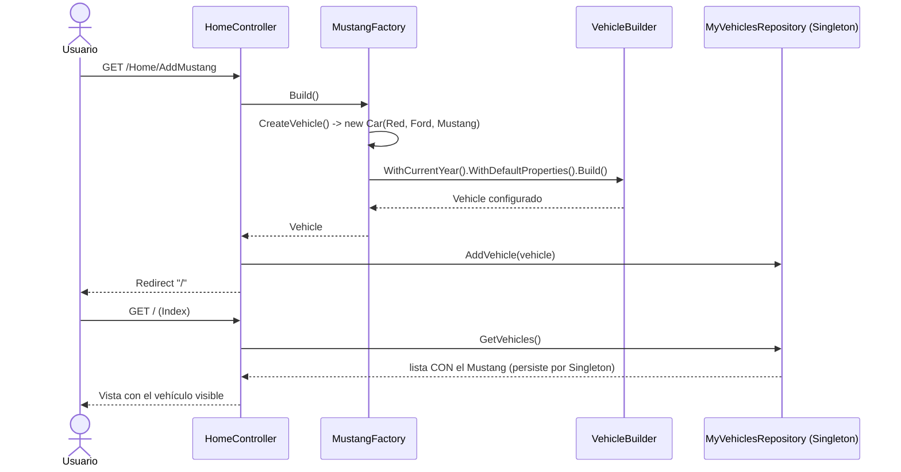

# Documento Técnico — Taller Formativo: Principios SOLID y Patrones de Diseño

**Asignatura:** Tarea 12 — Aplicación de mejores prácticas, principios SOLID y patrones de diseño
**Empresa (escenario):** Codificando Con Patrones Cía. Ltda. — Aplicativo de automóviles
**Repositorio:** https://github.com/michantord/Taller-Formativo.git
**Modalidad:** Individual

---

## 1. Identificación del problema dentro de las restricciones del proyecto

### 1.1 Contexto

El aplicativo de automóviles permite registrar vehículos (Mustang, Explorer), encender/apagar el motor y cargar combustible. Existen dos frentes de código:


- **Backend MVC en ASP.NET Core (.NET 8)** — carpeta `DesignPatterns/`.
- **Migración del core a una web app moderna en Next.js 16 / React 19** — carpeta `headapps/app/`.

El equipo anterior dejó implementado un **patrón Repository** con operaciones CRUD, pero QA reporta que **agregar vehículos no funciona como se espera**.

### 1.2 Problemas encontrados (descripción técnica)

| # | Problema | Causa raíz (técnica) | Restricción asociada |
|---|----------|----------------------|----------------------|
| **P1** | Al agregar Mustang/Explorer, el vehículo **no aparece** en el listado (reporte de QA). | En `ServicesConfiguration.cs` el repositorio se registró como **`AddTransient`**. Transient crea una **instancia nueva por cada resolución** del contenedor de DI. Como `MyVehiclesRepository` mantiene los vehículos en una `List<Vehicle>` **en memoria de instancia**, cada request (incluido el redirect a `Index`) obtiene un repositorio **vacío**. Los datos se pierden entre requests. | Ciclo de vida incorrecto del servicio en el contenedor de Inyección de Dependencias. |
| **P2** | No se puede persistir en base de datos todavía. | El **esquema de BD no está listo**. `DBVehicleRepository` lanza `NotImplementedException`. | Dependencia externa bloqueante: se debe poder **probar la funcionalidad sin BD**. |
| **P3** | El negocio pide **año actual + 20 propiedades por defecto** (próximo sprint). | El modelo `Vehicle` arma sus valores en el **constructor**. Agregar 20 propiedades fijas obligaría a modificar la clase y todas sus llamadas en cada sprint (**telescoping constructor**). | Requisito volátil: hay que **minimizar el impacto de cambios futuros**. |
| **P4** | Se planean **nuevos modelos** (empezando por Ford Escape rojo). | La creación de vehículos estaba **hardcodeada** en el controlador (`new Car("red","Ford","Mustang")`). Cada modelo nuevo implica tocar el controlador (viola Abierto/Cerrado). | Crecimiento previsto del catálogo de modelos. |
| **P5** | En Next.js, el **botón "Add Explorer" no refleja el vehículo** agregado. | El `Server Action` guardaba el vehículo pero **no revalidaba** la ruta, y el `onSubmit` del cliente ejecutaba `window.location.reload()` **antes** de que el action terminara (**condición de carrera**). | Mismo problema conceptual que P1 trasladado al stack moderno. |

### 1.3 Limitaciones y restricciones globales

- **R1 — Sin base de datos:** la solución debe funcionar end-to-end usando almacenamiento en memoria, y permitir cambiar a BD **sin reescribir** la lógica de negocio.
- **R2 — Cambios futuros minimizados:** las 20 propiedades del próximo sprint no deben forzar refactors grandes.
- **R3 — Extensibilidad de modelos:** agregar modelos no debe romper el código existente.
- **R4 — Doble stack:** la solución debe aplicarse de forma equivalente en .NET y en Next.js.

---

## 2. Selección de metodologías y patrones para solucionar el problema

### 2.1 Principios SOLID aplicados

- **S — Responsabilidad Única:** se separa "qué vehículo crear" (Factory) de "cómo se configuran sus valores por defecto" (Builder) y de "dónde se guarda" (Repository).
- **O — Abierto/Cerrado:** agregar un modelo o una propiedad por defecto se hace **agregando** clases/líneas, sin **modificar** las existentes.
- **D — Inversión de Dependencias:** el controlador depende de la abstracción `IVehicleRepository`, no de una implementación concreta; el contenedor de DI inyecta la implementación.

### 2.2 Patrones seleccionados y justificación

| Patrón | Dónde | Problema que resuelve | Justificación técnica |
|--------|-------|-----------------------|------------------------|
| **Repository** (ya existente, corregido) | `IVehicleRepository`, `MyVehiclesRepository`, `DBVehicleRepository` | P1, P2 (R1) | Abstrae el origen de datos. Hoy se usa la implementación **en memoria**; cuando la BD esté lista, se cambia **una línea** en DI y el resto del código no se entera. |
| **Inyección de Dependencias (ciclo de vida Singleton)** | `ServicesConfiguration.cs` | P1 | Corrige el bug de QA: el repositorio en memoria debe **vivir durante toda la app** (`AddSingleton`), no recrearse por request. |
| **Builder** | `Patterns/Builders/VehicleBuilder.cs` | P3 (R2) | Construye el vehículo paso a paso (año actual + propiedades por defecto) con interfaz fluida. Las 20 propiedades del próximo sprint se agregan como **líneas nuevas** en `WithDefaultProperties()`, sin tocar `Vehicle` ni el controlador. Usa además un **diccionario de propiedades** para no agregar columnas fijas. |
| **Factory Method** | `Patterns/Factories/*` | P4 (R3) | Cada modelo tiene su fábrica concreta (`MustangFactory`, `ExplorerFactory`, `EscapeFactory`). Agregar un modelo = **crear una clase**, sin modificar las demás (Abierto/Cerrado). |
| **Mismo enfoque en Next.js** | `lib/factories/vehicle-factory.ts`, `actions/add-explorer.ts` | P5 | Factory Method en TypeScript + `revalidatePath("/")` para refrescar el server component tras el `Server Action`. |

### 2.3 Diagramas UML

#### a) Patrón Repository + Inyección de Dependencias



#### b) Patrón Factory Method + Builder



#### c) Secuencia: agregar un Mustang (flujo corregido)



---

## 3. Propuesta técnica — Prototipo de la solución

### 3.1 Cambios implementados (.NET 8)

| Archivo | Cambio |
|---------|--------|
| `Infraestructure/DependencyInjection/ServicesConfiguration.cs` | `AddTransient` → **`AddSingleton`** (fix del bug de QA, P1). Comentario para cambiar a `DBVehicleRepository` cuando la BD esté lista (R1). |
| `Models/Vehicle.cs` | Se agregan `Year` y `Properties` (diccionario flexible) para soportar las propiedades por defecto sin inflar la clase (P3/R2). |
| `Patterns/Builders/VehicleBuilder.cs` | **Builder** que aplica año actual + propiedades por defecto (P3). |
| `Patterns/Factories/VehicleFactory.cs` (+ `MustangFactory`, `ExplorerFactory`, `EscapeFactory`) | **Factory Method** para crear modelos; se agrega el nuevo **Escape** sin tocar lo existente (P4). |
| `Controllers/HomeController.cs` | `AddMustang`/`AddExplorer` ahora usan Factory + Builder; se agrega `AddEscape`. |
| `Views/Home/Index.cshtml` | Columna **Año** y botón **Add Escape**. |

### 3.2 Cambios implementados (Next.js)

| Archivo | Cambio |
|---------|--------|
| `lib/factories/vehicle-factory.ts` | **Factory Method** en TypeScript (Mustang/Explorer/Escape) con año actual por defecto. |
| `actions/add-explorer.ts` | Usa la fábrica y agrega **`revalidatePath("/")`** para refrescar el listado (fix P5). |
| `components/ActionBar.tsx` | Se elimina el `onSubmit` con `window.location.reload()` (condición de carrera). |

### 3.3 Verificación

- **.NET:** `dotnet build` → *Compilación correcta, 0 advertencias, 0 errores*.
- **Next.js:** `npx tsc --noEmit` → sin errores de tipos.
- **Funcional:** agregar Mustang/Explorer/Escape ahora muestra el vehículo con su año; el botón de Next.js refleja el vehículo agregado.

### 3.4 Cómo ejecutar localmente

**Backend .NET**
```bash
cd DesignPatterns
dotnet run
# Abrir la URL que indique la consola (p. ej. https://localhost:5001)
```

**Frontend Next.js**
```bash
cd headapps/app
npm install
npm run dev
# Abrir http://localhost:3000
```

### 3.5 Diseño para el próximo sprint (minimizar cambios)

- **20 propiedades por defecto:** se agregan como líneas `WithProperty("clave", valor)` dentro de `VehicleBuilder.WithDefaultProperties()`. No se modifica `Vehicle`, ni el controlador, ni el repositorio.
- **Nuevos modelos:** se crea una nueva `XxxFactory : VehicleFactory`. No se toca ninguna fábrica existente.
- **Base de datos:** se implementa `DBVehicleRepository` y se cambia **una línea** en `ServicesConfiguration.cs`.

---

## 4. Evidencia en video

El guion de la grabación de evidencia está en `docs/Guion-Video.md`.
